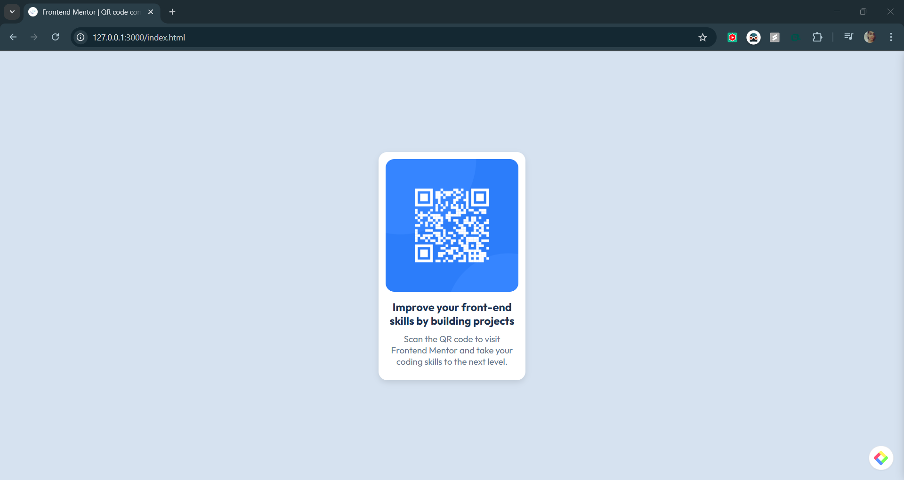

# Frontend Mentor - QR Code Component Solution

This is my solution to the [QR Code Component challenge on Frontend Mentor](https://www.frontendmentor.io/challenges/qr-code-component-iux_sIO_H). This challenge helped me practice building a simple but clean component using HTML and CSS.

## 📸 Screenshot



## 🔗 Links

- [Live Site URL](#) (Add your live site URL here)

## 🛠️ Built With

- Semantic HTML5 markup
- CSS custom properties
- Flexbox
- Mobile-first workflow

## 💡 What I Learned

During this project, I improved my understanding of **CSS Flexbox** and **centering elements on a page**. I also practiced using **box shadows** to enhance the visual appeal of UI components.

Here’s an example of centering the card using `display: flex;`:

```css
body {
  background-color: hsl(212, 45%, 89%);
  display: flex;
  justify-content: center;
  align-items: center;
  height: 100vh;
  padding: 10px;
}
```

## 🚀 Continued Development

Going forward, I plan to:
- Improve responsiveness for different screen sizes.
- Experiment with CSS Grid for better layout management.
- Learn more about accessibility improvements.

## 📚 Useful Resources

- [CSS Tricks - A Complete Guide to Flexbox](https://css-tricks.com/snippets/css/a-guide-to-flexbox/) - Helped me understand how to properly center elements.
- [MDN Web Docs - Box Shadow](https://developer.mozilla.org/en-US/docs/Web/CSS/box-shadow) - Useful for adding depth to UI elements.

## 👤 Author

- Frontend Mentor - [@pavanimankonda](https://www.frontendmentor.io/profile/pavanimankonda)  
- GitHub - [@pavanimankonda](https://github.com/pavanimankonda)

## 🎉 Acknowledgments

Thanks to **Frontend Mentor** for providing great challenges to improve my frontend skills! 🚀

